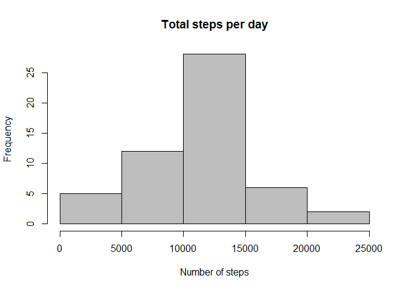
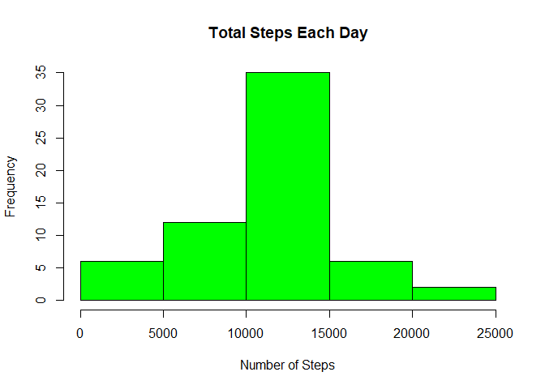
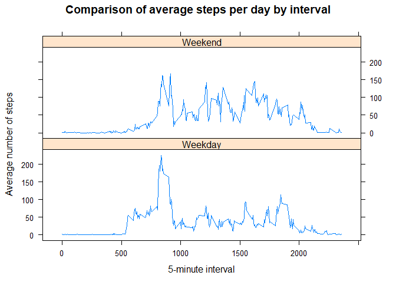

## Objectives

The purpose of this project was to practice:

* loading and preprocessing data
* imputing missing values
* interpreting data to answer research questions

## Data  
The data for this assignment was downloaded from the course web
site:

* Dataset: [Activity monitoring data]("https://d396qusza40orc.cloudfront.net/repdata%2Fdata%2Factivity.zip") [52K]

The variables included in this dataset are:

* **steps**: Number of steps taking in a 5-minute interval (missing
    values are coded as `NA`)

* **date**: The date on which the measurement was taken in YYYY-MM-DD
    format

* **interval**: Identifier for the 5-minute interval in which
    measurement was taken

The dataset is stored in a comma-separated-value (CSV) file and there are a total of 17,568 observations in this dataset.

## Loading and preprocessing the data

Download, unzip and load data into data frame `activitydata`. 


```r
if(!file.exists("activity.csv")) {
    # download file from web
    download.file("https://d396qusza40orc.cloudfront.net/repdata%2Fdata%2Factivity.zip", destfile = "activity.zip", mode="wb")
    # unzip data 
    unzip("activity.zip")
}
# Read data
activitydata <- read.csv("activity.csv")
```


```r
head(activitydata)
```

```
##   steps       date interval
## 1    NA 2012-10-01        0
## 2    NA 2012-10-01        5
## 3    NA 2012-10-01       10
## 4    NA 2012-10-01       15
## 5    NA 2012-10-01       20
## 6    NA 2012-10-01       25
```

```r
summary(activitydata)
```

```
##      steps                date          interval     
##  Min.   :  0.00   2012-10-01:  288   Min.   :   0.0  
##  1st Qu.:  0.00   2012-10-02:  288   1st Qu.: 588.8  
##  Median :  0.00   2012-10-03:  288   Median :1177.5  
##  Mean   : 37.38   2012-10-04:  288   Mean   :1177.5  
##  3rd Qu.: 12.00   2012-10-05:  288   3rd Qu.:1766.2  
##  Max.   :806.00   2012-10-06:  288   Max.   :2355.0  
##  NA's   :2304     (Other)   :15840
```

## What is mean total number of steps taken per day?  
Sum steps by day, create Histogram, and calculate mean and median.


```r
steps_by_day <- aggregate(steps ~ date, activitydata, sum)
hist(steps_by_day$steps, main = "Total steps per day", col="grey", xlab="Number of steps")
```

<!-- -->

```r
steps_mean <- mean(steps_by_day$steps)
steps_median <- median(steps_by_day$steps)
```

The `mean` is 1.0766189\times 10^{4} and the `median` is 10765.

## What is the average daily activity pattern?

* Calculate average steps for each interval for all days. 
* Plot the Average Number Steps per Day by Interval. 
* Find interval with most average steps. 


```r
steps_by_interval <- aggregate(steps ~ interval, activitydata, mean)
plot(steps_by_interval$interval,steps_by_interval$steps, type="l", xlab="Interval", ylab="Number of Steps",main="Average Number of Steps per Day by Interval")
```

<!-- -->

```r
max_interval <- steps_by_interval[which.max(steps_by_interval$steps),1]
```

The 5-minute interval, on average across all the days in the data set, containing the maximum number of steps is 835.

## Impute missing values. Compare imputed to non-imputed data.  

Missing data needed to be imputed. Only a simple imputation approach was required for this assignment. 
Missing values were imputed by inserting the average for each interval. Thus, if interval 10 was missing on 10-02-2012, the average for that interval for all days (0.1320755), replaced the NA. 


Calculate and report the total number of missing values in the dataset`


```r
incomplete <- sum(!complete.cases(activitydata))
```

So, the total number of missing values in the dataset (i.e. the total number of rows with `NAS`) is 2304


```r
incomplete <- sum(!complete.cases(activitydata))
imputed_data <- transform(activitydata, steps = ifelse(is.na(activitydata$steps), steps_by_interval$steps[match(activitydata$interval, steps_by_interval$interval)], activitydata$steps))
```

Zeroes were imputed for 10-01-2012 because it was the first day and would have been over 9,000 steps higher than the following day, which had only 126 steps. NAs then were assumed to be zeros to fit the rising trend of the data. 


```r
imputed_data[as.character(imputed_data$date) == "2012-10-01", 1] <- 0
```

Recount total steps by day and create Histogram. 


```r
steps_by_day_i <- aggregate(steps ~ date, imputed_data, sum)
hist(steps_by_day_i$steps, main = paste("Total Steps Each Day"), col="green", xlab="Number of Steps")
```

<!-- -->


Calculate new mean and median for imputed data. 

```r
steps_mean.i <- mean(steps_by_day_i$steps)
steps_median.i <- median(steps_by_day_i$steps)
```

Calculate difference between imputed and non-imputed data.

```r
mean_diff <- steps_mean.i - steps_mean
median_diff <- steps_median.i - steps_median
```

Calculate total difference.

```r
total_diff <- sum(steps_by_day_i$steps) - sum(steps_by_day$steps)
```

* The imputed data mean is 1.0589694\times 10^{4}
* The imputed data median is 1.0766189\times 10^{4}
* The difference between the non-imputed mean and imputed mean is -176.4948964
* The difference between the non-imputed median and imputed median is 1.1886792
* The difference between total number of steps between imputed and non-imputed data is 7.5363321\times 10^{4}. Thus, there were 7.5363321\times 10^{4} more steps in the imputed data.

## Are there differences in activity patterns between weekdays and weekends?

Created a plot to compare and contrast number of steps between the week and weekend. There is a higher peak earlier on weekdays, and more overall activity on weekends.  


```r
weekdays <- c("Monday", "Tuesday", "Wednesday", "Thursday", "Friday")
imputed_data$dow = as.factor(ifelse(is.element(weekdays(as.Date(imputed_data$date)),weekdays), "Weekday", "Weekend"))
steps_by_interval_i <- aggregate(steps ~ interval + dow, imputed_data, mean)

library(lattice)
xyplot(steps_by_interval_i$steps ~ steps_by_interval_i$interval|steps_by_interval_i$dow, main="Comparison of average steps per day by interval",xlab="5-minute interval", ylab="Average number of steps",layout=c(1,2), type="l")
```

<!-- -->

